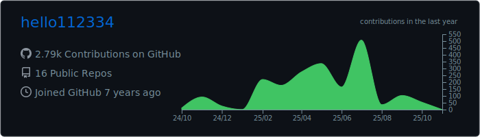
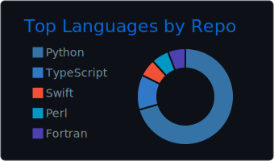

## Hi there 👋

<!--
**hello112334/hello112334** is a ✨ _special_ ✨ repository because its `README.md` (this file) appears on your GitHub profile.

Here are some ideas to get you started:

- 🔭 I’m currently working on ...
- 🌱 I’m currently learning ...
- 👯 I’m looking to collaborate on ...
- 🤔 I’m looking for help with ...
- 💬 Ask me about ...
- 📫 How to reach me: ...
- 😄 Pronouns: ...
- ⚡ Fun fact: ...
-->

 
 

---

- Homepage
https://www.icyanstudio.net

- wowomap
https://wowomap.icyanstudio.net

- openmap
https://openmap.icyanstudio.net

- openresearch
https://openresearch.icyanstudio.net

- coolplayer
https://coolplayer.icyanstudio.net

- Voice Note(Android Mobile App - internal test)
https://play.google.com/apps/internaltest/4701673881921649411

