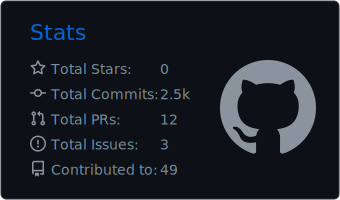

## Hi there 👋

<!--
**hello112334/hello112334** is a ✨ _special_ ✨ repository because its `README.md` (this file) appears on your GitHub profile.

Here are some ideas to get you started:

- 🔭 I’m currently working on ...
- 🌱 I’m currently learning ...
- 👯 I’m looking to collaborate on ...
- 🤔 I’m looking for help with ...
- 💬 Ask me about ...
- 📫 How to reach me: ...
- 😄 Pronouns: ...
- ⚡ Fun fact: ...
-->

 
 

---

- Homepage  
https://www.icyanstudio.net

- wowomap  
https://wowomap.icyanstudio.net

- openmap  
https://openmap.icyanstudio.net

- World View  
https://worldview.icyanstudio.net

- Open Research  
https://openresearch.icyanstudio.net

- Open Career  
https://opencareer.icyanstudio.net

- Open School  
https://openschool.icyanstudio.net

- Cool Player  
https://coolplayer.icyanstudio.net

- Voice Note(Android Mobile App - internal test)  
  - Google Group  
  https://groups.google.com/u/0/g/icyanstudio-android-mobile-app-close-test-group

  - Android  
  https://play.google.com/store/apps/details?id=com.icyanstudio.voice_note

  - Web  
  https://play.google.com/apps/testing/com.icyanstudio.voice_note 

